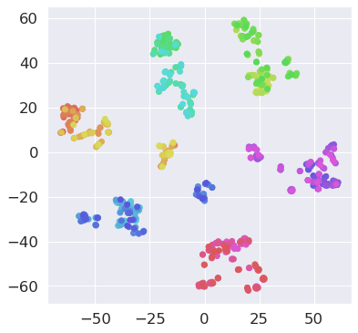
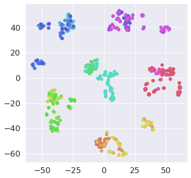
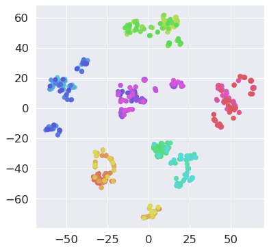

# Graph-Embedding
graduation research

## graph/
generate graph and then change to adjacency matrix

## dataset visualization (tnse)
<table style="background-color:white;">
  <tr> 
    <th>mean squared error(mse)</th><th>categorical cross entropy + mse</th><th>kl divergence + mse</th>
  </tr>
  <tr>
    <td></img></td>
    <td></img></td>
    <td></img></td>
  </tr>
</table>
